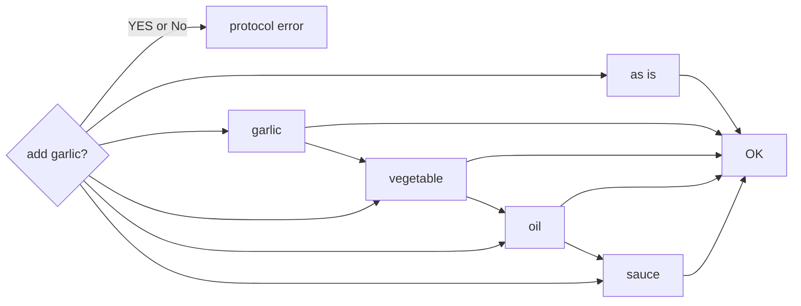

# SlidevのMarkdown記法<br>サンプル

公式サンプルにないtipsもあるよ

---
layout: intro
---

# 1章

各章の冒頭スライドはこのように表示されるのですね。

---
layout: intro
class: 'text-center'
---

# 1章

center表示もできます。

---
layout: cover
background: https://source.unsplash.com/collection/94734566/1920x1080
---

# 1章

seriphテーマで使えるcoverレイアウトです。このように背景画像も指定できます。

---

## 1.1. 見出しのレベルや書体の見栄えを見てみよう

<br>

# H1です

## H2です

### H3です

#### H4です

##### H5です

これは本文です。H4から先は書体が変わりませんね。どうやら有効なのはH3まででしょうか。<br>
でも、H3はかなり小さい文字になるのと灰色なのでほとんど使う機会はない印象。<br>

使用するテーマを変えたり、テーマをカスタマイズすることで変更できそうです。<br>
よいテーマを見つけた/作った方はぜひ教えて下さい。

**これは本文です(太字)**

~~これも本文です(取り消し)~~

*じゃあ私も本文です(イタリック)*

なお、&#045;&#045;&#045; を書くとページが区切られます。お試しくださいませ。

---

## 1.2. リスト

リストの表示を見てみましょう。<br>
なにげにGridレイアウト使って左右にコンテンツを配置していますのでその記法もご確認ください。

<div class="grid grid-cols-[50%,50%] gap-4"><div>

箇条書きリストだよ

- AAAA
  - aaaa
  - aaaa
- BBBB
  - bbbb
  - bbbb

</div><div>

番号付きリストだよ

1. AAAA
    1. aaaa
    1. aaaa
1. bbbb
    1. BBBB
    1. bbbb

</div></div>

<br>

普通、Markdownで以下のように書くと [ ] 部分がチェックボックスとして描画されますけどSlidevではそうならないみたいですね。<br>

- [ ] タスク1
- [x] タスク2


---

## 1.3. テーブル

テーブルがどのように表示されるか見てみましょう。

突然のPython講義。

[Python](https://www.python.org/)には、シーケンス型に属する型として以下があります。<br>

|                                                            型                                                             |                                       概要                                       |
| ------------------------------------------------------------------------------------------------------------------------- | -------------------------------------------------------------------------------- |
| [リスト](https://docs.python.org/ja/3/library/stdtypes.html#lists)                                                        | データの並びを表現できます。                                                     |
| [タプル](https://docs.python.org/ja/3/library/stdtypes.html#tuples)                                                       | リストと同じように使えますが、生成後は中身を変更できないことが保証されています。 |
| [range](https://docs.python.org/ja/3/library/stdtypes.html#ranges)                                                        | 数の並びを表します。ループと組み合わせて使うことが多いです。                     |
| [テキストシーケンス](https://docs.python.org/ja/3/library/stdtypes.html#text-sequence-type-str)                           | いわゆる文字列型です。                                                           |
| [バイナリシーケンス](https://docs.python.org/ja/3/library/stdtypes.html#binary-sequence-types-bytes-bytearray-memoryview) | バイナリ(バイト列)を扱えます。                                                   |

---

## 1.4. 画像

リロードするたびにランダムで画像が変わります。Gridレイアウトをタイルのようにつかうのも良さそうですね。

<div class="grid grid-cols-[33%,33%,33%] gap-4"><div>

[Nature](https://unsplash.com/t/nature)


</div><div>

[Technology](https://unsplash.com/t/technology)


</div><div>

[Travel](https://unsplash.com/t/travel)


</div></div>

画像などのassetsは`public`ディレクトリに格納すると良いです。SPAのドキュメントルートにコピーされます。


---

## 1.5. アイコン


[Icons | Slidev](https://sli.dev/guide/syntax.html#icons) に利用可能なアイコンの情報があります。

[Tailwind CSS](https://tailwindcss.com/docs/animation) のクラスを設定するとAnimationなど面白い効果が狙えるかもしれません。

<div class="grid grid-cols-[50%,50%] gap-4"><div>

<center>

<logos-chrome class="text-5xl m-12 animate-bounce"/>
<logos-firefox class="text-5xl m-12 animate-bounce"/>
<logos-microsoft-edge class="text-5xl m-12 animate-bounce"/>

</center>

</div><div class="content-center">

<center>

<twemoji-grinning-face-with-sweat class="text-5xl m-12 animate-pulse"/>
<twemoji-party-popper class="text-5xl m-12 animate-ping"/>
<twemoji-cat-with-tears-of-joy class="text-5xl m-12 animate-spin"/>

</center>

</div></div>

---

## 1.6. コード

<style>
.language-bash span.line { /* bashのコード */
  margin-left: -40px; /* 左に40px移動して行番号を隠す(邪道) */
}
</style>

行番号が表示されているのは `lineNumbers: true` のおかげです。<br>
4行目以降がハイライトされているのは `{4-}` のおかげです。

<div class="grid grid-cols-[50%,50%] gap-4"><div>
before

```python {4-}
import os
test_path = os.path.join("data", "data-01.txt")

f = open(test_path, "a", encoding="utf-8")
f.write("this is new append line\n")
f.close()
```

</div><div>
after

```python {4-}
import os
test_path = os.path.join("data", "data-01.txt")

with open(test_path, "a", encoding="utf-8") as f:
    f.write("this is new append line\n")
```

</div></div>

以下は行番号を表示しないようにしてみました。<br>
この章の&lt;style&gt;に指定している`language-bash span.line`をご参照ください。

```bash
$ ps aux
USER         PID %CPU %MEM    VSZ   RSS TTY      STAT START   TIME COMMAND
root           2  0.0  0.0      0     0 ?        S     7月20   0:00 [kthreadd]
root           3  0.0  0.0      0     0 ?        I<    7月20   0:00 [rcu_gp]
root           4  0.0  0.0      0     0 ?        I<    7月20   0:00 [rcu_par_gp]
root          12  0.0  0.0      0     0 ?        S     7月20   0:07 [migration/0]
```

---

## 1.7. LaTeX

組版にも対応。数式をかっこよく書きたい場合に使えそうですね。

$\sqrt{3x-1}+(1+x)^2$

これは中央に配置されるようです。

$$
\begin{array}{c}

\sin x = \sum_{n=0}^{\infty} \frac{(-1)^n}{(2n+1)!} x^{2n+1}

\end{array}
$$

であるからして、これがこうなってこうじゃ。

$$
\begin{array}{c}

\nabla \times \vec{\mathbf{B}} -\, \frac1c\, \frac{\partial\vec{\mathbf{E}}}{\partial t} &
= \frac{4\pi}{c}\vec{\mathbf{j}}    \nabla \cdot \vec{\mathbf{E}} & = 4 \pi \rho \\

\nabla \times \vec{\mathbf{E}}\, +\, \frac1c\, \frac{\partial\vec{\mathbf{B}}}{\partial t} & = \vec{\mathbf{0}} \\

\nabla \cdot \vec{\mathbf{B}} & = 0

\end{array}
$$

このページは講義資料のような雰囲気がありますね。

---

## 1.8. Twitter

<style>
.language-markdown span.line { /* markdownのコード */
  margin-left: -40px; /* 左に40px移動して行番号を隠す(邪道) */
}
</style>


Vueのコンポーネントが使えるので簡単に埋め込めます。<br>
画像ではないので文字コピーやリンククリックもできます。

<div class="grid grid-cols-[40%,60%] gap-4"><div>

<br><br><br>

Markdownに書くのはこれだけでOK。


```markdown
<Tweet id="1423237009561186308"/>
```

</div><div>

<Tweet id="1423237009561186308"/>

</div></div>

参考になったよという方はぜひTwitterのフォローといいねをポチッとしていただけると喜びます。

---

## 1.9. YouTube

YouTube動画の埋め込みコード(HTML)を貼りつけてみました。動画が埋め込めています。<br>
スライド上で動画を再生できるのは画面切り替えが不要なので嬉しいですね。

<center>
<iframe width="560" height="315" src="https://www.youtube.com/embed/OQmr5MLpF_4" title="YouTube video player" frameborder="0" allow="accelerometer; autoplay; clipboard-write; encrypted-media; gyroscope; picture-in-picture" allowfullscreen></iframe>
</center>

YouTubeに限らず、各種サイトで埋め込みコードが用意されているものはスライドに埋め込める可能性があります。<br>
ただし&lt;scrpit&gt;タグで埋め込むタイプのコンテンツは埋め込めないかもです。

---

## 1.10. Flowchart diagrams

[Mermaid記法](https://sli.dev/guide/syntax.html#diagrams) による Jiro Flow



---
layout: cover
---

# ご清聴ありがとうございました。

よいSlidevライフを！